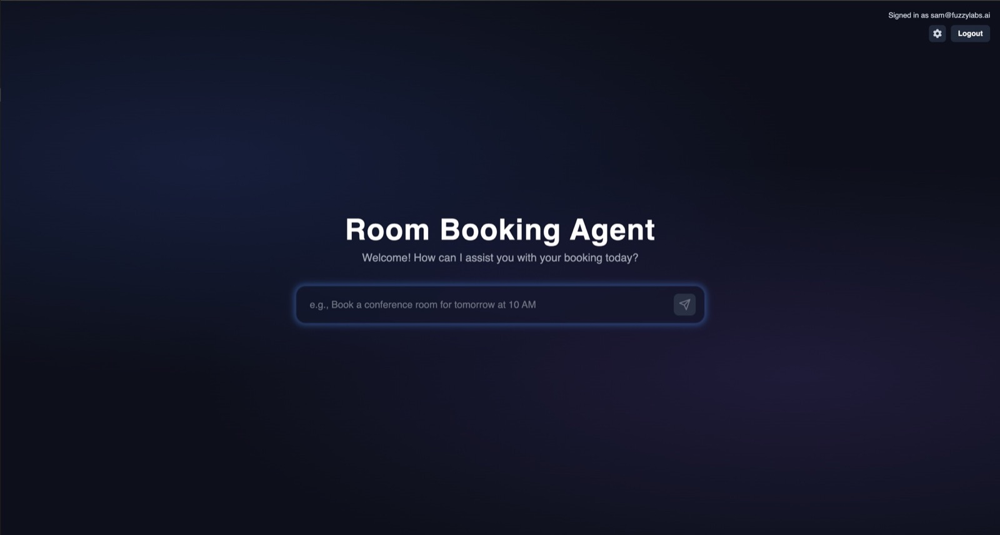
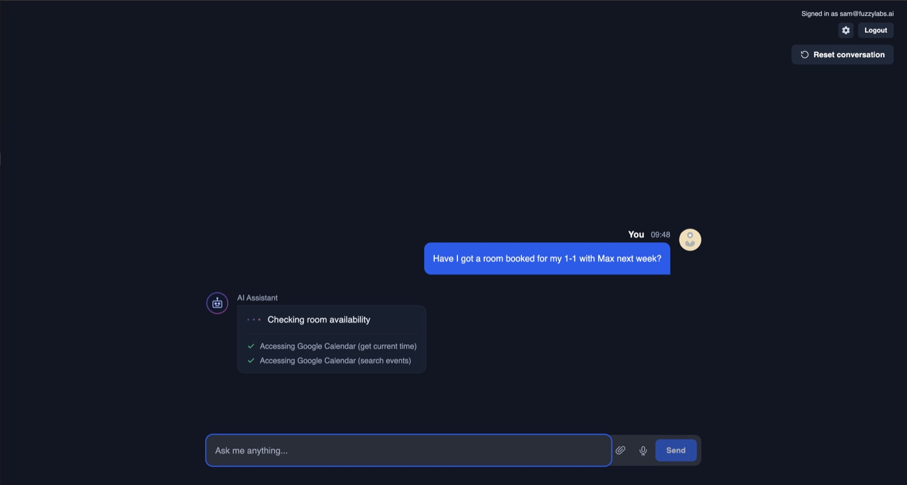
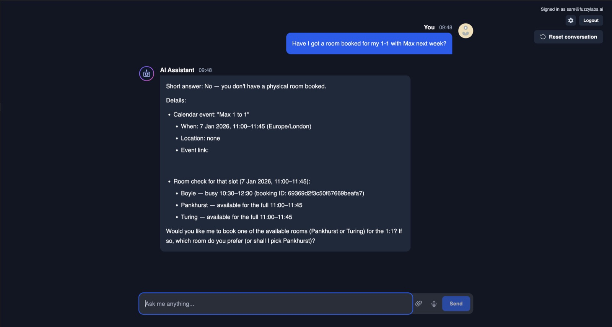

# DiSH Meeting Room Booking Agent

An AI-powered assistant that seamlessly manages your meeting room bookings and calendar in one conversation. Simply ask it to book a room, check availability, or schedule meetings. It handles the coordination between DiSH room reservations and Google Calendar automatically.

The meeting room booking website for my office (DiSH) was pretty terrible and made booking recurring meetings difficult and time consuming. I built this agent to save on all the manual time spent block booking meeting rooms. It has so far saved me so much time and I use it every week!

**Key Features:**
- 🗓️ Natural language scheduling — *"Book me a room tomorrow at 2pm for an hour"*
- 🔍 Smart availability checking across rooms and calendars
- 🔄 Automatic coordination between room bookings and calendar events
- 💬 Conversational interface with streaming responses

Built with [Pydantic AI](https://ai.pydantic.dev/) and the [Model Context Protocol (MCP)](https://modelcontextprotocol.io/) for extensible tool integration.

## Screenshots





## Prerequisites

- Python 3.12+ with [`uv`](https://docs.astral.sh/uv/) installed
- [Bun](https://bun.sh/) for the frontend
- Docker and Docker Compose
- Access to the DiSH MCP repository (set `DISH_MCP_PATH` to its root; it must have a `.venv` with `fastmcp` installed via `uv sync`)

## Quick Start

```bash
# 1. Clone and enter the repository
cd dish-booking-agent

# 2. Copy and configure environment variables
cp example.env .env
# Edit .env with your values (API keys, passwords, etc.)

# 3. Install dependencies
cd backend && uv sync && cd ..
cd frontend && bun install && cd ..

# 4. Start all services
make dev
```

This will start:
- **Keycloak** (authentication): http://localhost:8080
- **Backend API** (FastAPI): http://localhost:8000
- **Frontend** (Next.js): http://localhost:3000

## Development Commands

| Command | Description |
|---------|-------------|
| `make dev` | Start all services (infrastructure + backend + frontend) |
| `make infra` | Start only Docker services (databases + Keycloak) |
| `make backend` | Start only the FastAPI backend |
| `make frontend` | Start only the Next.js frontend |
| `make stop` | Stop all running services |
| `make logs` | Tail Docker container logs |
| `make clean` | Stop services and remove Docker volumes |
| `make help` | Show available commands |

## Configuration

### Environment Variables

Copy `example.env` to `.env` and configure:

```bash
cp example.env .env
```

Required variables:

| Variable | Description |
|----------|-------------|
| `KEYCLOAK_POSTGRES_PASSWORD` | Password for Keycloak's database |
| `KEYCLOAK_BOOTSTRAP_ADMIN_PASSWORD` | Keycloak admin console password |
| `POSTGRES_PASSWORD` | Password for the user database |
| `OPENAI_API_KEY` | Your OpenAI API key |
| `DISH_MCP_PATH` | Absolute path to the DiSH MCP repository |
| `DISH_COOKIE` | Your DiSH authentication cookie |
| `TEAM_ID` | Your DiSH team ID |
| `MEMBER_ID` | Your DiSH member ID |
| `GOOGLE_OAUTH_CREDENTIALS` | Path to Google OAuth JSON for Calendar MCP |

### Backend Configuration

The backend also reads from `backend/.env` for additional settings. See `backend/example.env` for reference.

## Architecture

```
┌─────────────────────────────────────────────────────────────────┐
│                         Frontend (Next.js)                      │
│                        http://localhost:3000                    │
└─────────────────────────────────┬───────────────────────────────┘
                                  │
                                  ▼
┌─────────────────────────────────────────────────────────────────┐
│                      Backend API (FastAPI)                      │
│                        http://localhost:8000                    │
│  ┌─────────────┐  ┌─────────────┐  ┌─────────────────────────┐  │
│  │ Pydantic AI │  │ DiSH MCP    │  │ Google Calendar MCP     │  │
│  │   Agent     │──│  (rooms)    │  │  (calendar events)      │  │
│  └─────────────┘  └─────────────┘  └─────────────────────────┘  │
└─────────────────────────────────┬───────────────────────────────┘
                                  │
          ┌───────────────────────┼───────────────────────┐
          ▼                       ▼                       ▼
┌─────────────────┐   ┌─────────────────┐   ┌─────────────────┐
│    Keycloak     │   │   Keycloak DB   │   │    User DB      │
│  (port 8080)    │   │   (PostgreSQL)  │   │  (port 5433)    │
└─────────────────┘   └─────────────────┘   └─────────────────┘
```

## API Endpoints

- `GET /health` - Health check
- `GET /send-message?message=<msg>&session=<id>` - Send a message to the AI agent

The `session` parameter maintains separate conversational histories.

## Running Individual Components

### CLI Agent (without API)

```bash
cd backend
uv run src/agent.py
```

### Backend Only

```bash
make infra  # Start databases first
make backend
```

### Frontend Only

```bash
make frontend
```

## Example Prompts

- "List my calendar events tomorrow morning."
- "Book a room from 14:00–15:00 tomorrow and create a calendar invite for it."
- "Reschedule the 13:00 sync to 15:00 and keep the same attendees."
- "What rooms are available next Monday afternoon?"

## Troubleshooting

### Services won't start

1. Ensure Docker is running
2. Check that ports 3000, 5433, 8000, and 8080 are not in use
3. Verify your `.env` file has all required variables set

### Database connection issues

```bash
# Check if databases are healthy
docker compose ps

# View database logs
docker compose logs user-db
docker compose logs keycloak-db
```

### Reset everything

```bash
make clean  # Stops services and removes volumes
make dev    # Fresh start
```

## Testing

### Unit Tests

The backend includes unit tests located in `backend/tests/`. Run them with:

```bash
cd backend
uv run pytest
```

> **Note:** The unit tests were generated using Claude Opus 4.5 in the absence of time to write them manually. Whilst they provide some coverage and are better than no tests at all, they should not be fully relied upon and may require review or refinement for production use.

## Manual Test Flow

1. Start all services with `make dev`
2. Navigate to http://localhost:3000
3. Authenticate via Keycloak
4. Ask for upcoming events on a given day
5. Book a DiSH room and request a matching Google Calendar invite
6. Reschedule or cancel events to verify the integration
